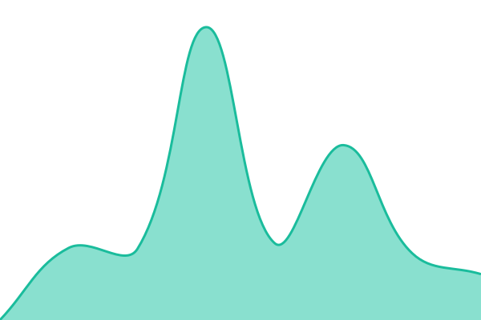
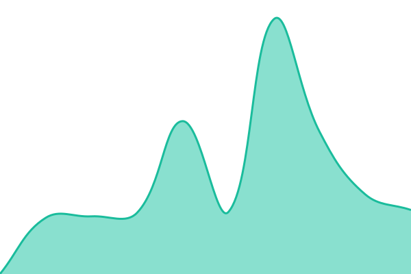
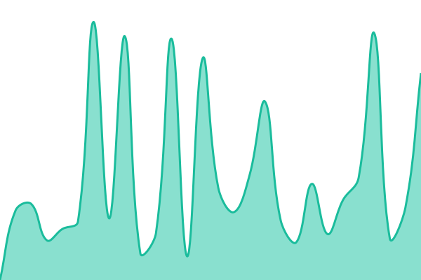

# [📈 Live Status](https://demo.upptime.js.org): <!--live status--> **🟩 All systems operational**

This repository contains the open-source uptime monitor and status page for [Upptime](https://upptime.js.org), powered by [Upptime](https://github.com/upptime/upptime).

With [Upptime](https://upptime.js.org), you can get your own unlimited and free uptime monitor and status page, powered entirely by a GitHub repository. We use [Issues](https://github.com/upptime/upptime/issues) as incident reports, [Actions](https://github.com/hariidfidina20-sudo/SERVER-MONITORING/actions) as uptime monitors, and [Pages](https://demo.upptime.js.org) for the status page.

<!--start: status pages-->
<!-- This summary is generated by Upptime (https://github.com/upptime/upptime) -->
<!-- Do not edit this manually, your changes will be overwritten -->
<!-- prettier-ignore -->
| URL | Status | History | Response Time | Uptime |
| --- | ------ | ------- | ------------- | ------ |
|  PROXMOX UTAMA | 🟩 Up | [proxmox-utama.yml](https://github.com/hariidfidina20-sudo/SERVER-MONITORING/commits/HEAD/history/proxmox-utama.yml) | 

 923ms
     
 | 

<a href="https://hariidfidina20-sudo.github.io/SERVER-MONITORING/history/proxmox-utama">100.00%</a>
    

|  ZAHIR | 🟩 Up | [zahir.yml](https://github.com/hariidfidina20-sudo/SERVER-MONITORING/commits/HEAD/history/zahir.yml) | 

 443ms
     
 | 

<a href="https://hariidfidina20-sudo.github.io/SERVER-MONITORING/history/zahir">100.00%</a>
    

|  LOWCODER | 🟩 Up | [lowcoder.yml](https://github.com/hariidfidina20-sudo/SERVER-MONITORING/commits/HEAD/history/lowcoder.yml) | 

 1054ms
     
 | 

<a href="https://hariidfidina20-sudo.github.io/SERVER-MONITORING/history/lowcoder">100.00%</a>
    

|  HOMEBOOK | 🟩 Up | [homebook.yml](https://github.com/hariidfidina20-sudo/SERVER-MONITORING/commits/HEAD/history/homebook.yml) | 

 1217ms
     
 | 

<a href="https://hariidfidina20-sudo.github.io/SERVER-MONITORING/history/homebook">100.00%</a>
    

|  TB40 | 🟩 Up | [tb-40.yml](https://github.com/hariidfidina20-sudo/SERVER-MONITORING/commits/HEAD/history/tb-40.yml) | 

 1724ms
     
 | 

<a href="https://hariidfidina20-sudo.github.io/SERVER-MONITORING/history/tb-40">100.00%</a>
    

|  RAPOR SD | 🟩 Up | [rapor-sd.yml](https://github.com/hariidfidina20-sudo/SERVER-MONITORING/commits/HEAD/history/rapor-sd.yml) | 

 1381ms
     
 | 

<a href="https://hariidfidina20-sudo.github.io/SERVER-MONITORING/history/rapor-sd">100.00%</a>
    

|  GRIST DATABASE PEGAWAI | 🟩 Up | [grist-database-pegawai.yml](https://github.com/hariidfidina20-sudo/SERVER-MONITORING/commits/HEAD/history/grist-database-pegawai.yml) | 

 1143ms
     
 | 

<a href="https://hariidfidina20-sudo.github.io/SERVER-MONITORING/history/grist-database-pegawai">100.00%</a>
    

<!--end: status pages-->

[**Visit our status website →**](https://demo.upptime.js.org)

## 📄 License

- Powered by: [Upptime](https://github.com/upptime/upptime)
- Code: [MIT](./LICENSE) © [Anand Chowdhary](https://anandchowdhary.com), supported by [Pabio](https://pabio.com)
- Data in the `./history` directory: [Open Database License](https://opendatacommons.org/licenses/odbl/1-0/)
