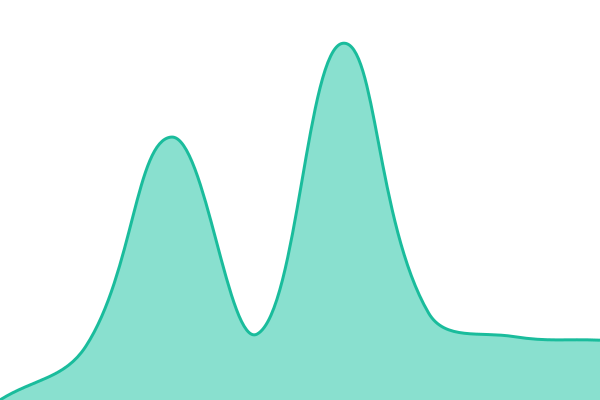
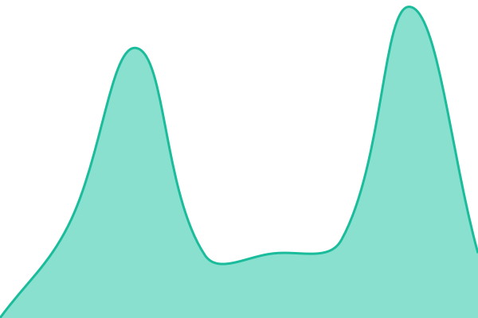
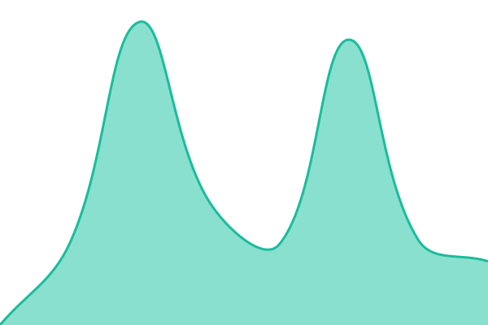
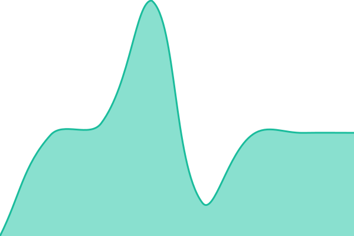
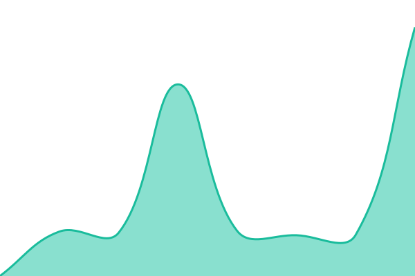
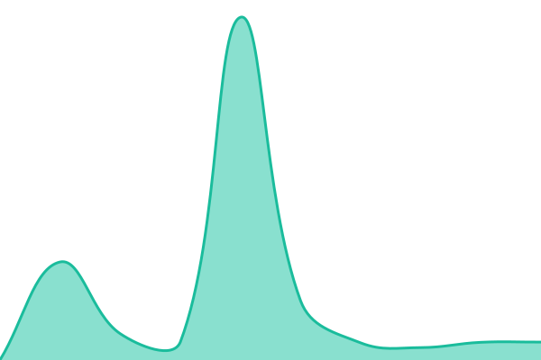

# [📈 Live Status](https://demo.upptime.js.org): <!--live status--> **🟧 Partial outage**

This repository contains the open-source uptime monitor and status page for [Upptime](https://upptime.js.org), powered by [Upptime](https://github.com/upptime/upptime).

With [Upptime](https://upptime.js.org), you can get your own unlimited and free uptime monitor and status page, powered entirely by a GitHub repository. We use [Issues](https://github.com/upptime/upptime/issues) as incident reports, [Actions](https://github.com/hariidfidina20-sudo/SERVER-MONITORING/actions) as uptime monitors, and [Pages](https://demo.upptime.js.org) for the status page.

<!--start: status pages-->
<!-- This summary is generated by Upptime (https://github.com/upptime/upptime) -->
<!-- Do not edit this manually, your changes will be overwritten -->
<!-- prettier-ignore -->
| URL | Status | History | Response Time | Uptime |
| --- | ------ | ------- | ------------- | ------ |
|  PROXMOX UTAMA | 🟩 Up | [proxmox-utama.yml](https://github.com/hariidfidina20-sudo/SERVER-MONITORING/commits/HEAD/history/proxmox-utama.yml) | 

 647ms
     
 | 

<a href="https://hariidfidina20-sudo.github.io/SERVER-MONITORING/history/proxmox-utama">100.00%</a>
    

|  ZAHIR | 🟩 Up | [zahir.yml](https://github.com/hariidfidina20-sudo/SERVER-MONITORING/commits/HEAD/history/zahir.yml) | 

 420ms
     
 | 

<a href="https://hariidfidina20-sudo.github.io/SERVER-MONITORING/history/zahir">100.00%</a>
    

|  LOWCODER | 🟥 Down | [lowcoder.yml](https://github.com/hariidfidina20-sudo/SERVER-MONITORING/commits/HEAD/history/lowcoder.yml) | 

 1972ms
     
 | 

<a href="https://hariidfidina20-sudo.github.io/SERVER-MONITORING/history/lowcoder">100.00%</a>
    

|  HOMEBOOK | 🟩 Up | [homebook.yml](https://github.com/hariidfidina20-sudo/SERVER-MONITORING/commits/HEAD/history/homebook.yml) | 

 1050ms
     
 | 

<a href="https://hariidfidina20-sudo.github.io/SERVER-MONITORING/history/homebook">100.00%</a>
    

|  TB40 | 🟥 Down | [tb-40.yml](https://github.com/hariidfidina20-sudo/SERVER-MONITORING/commits/HEAD/history/tb-40.yml) | 

 1485ms
     
 | 

<a href="https://hariidfidina20-sudo.github.io/SERVER-MONITORING/history/tb-40">100.00%</a>
    

|  RAPOR SD | 🟩 Up | [rapor-sd.yml](https://github.com/hariidfidina20-sudo/SERVER-MONITORING/commits/HEAD/history/rapor-sd.yml) | 

 1581ms
     
 | 

<a href="https://hariidfidina20-sudo.github.io/SERVER-MONITORING/history/rapor-sd">100.00%</a>
    

|  GRIST DATABASE | 🟩 Up | [grist-database.yml](https://github.com/hariidfidina20-sudo/SERVER-MONITORING/commits/HEAD/history/grist-database.yml) | 

 1013ms
     
 | 

<a href="https://hariidfidina20-sudo.github.io/SERVER-MONITORING/history/grist-database">100.00%</a>
    

|  PAPERLESS | 🟩 Up | [paperless.yml](https://github.com/hariidfidina20-sudo/SERVER-MONITORING/commits/HEAD/history/paperless.yml) | 

 1100ms
     
 | 

<a href="https://hariidfidina20-sudo.github.io/SERVER-MONITORING/history/paperless">100.00%</a>
    

|  TTD INSAN TAQWA | 🟥 Down | [ttd-insan-taqwa.yml](https://github.com/hariidfidina20-sudo/SERVER-MONITORING/commits/HEAD/history/ttd-insan-taqwa.yml) | 

 2007ms
     
 | 

<a href="https://hariidfidina20-sudo.github.io/SERVER-MONITORING/history/ttd-insan-taqwa">100.00%</a>
    

|  APLIKASI INSANTAQWA | 🟩 Up | [aplikasi-insantaqwa.yml](https://github.com/hariidfidina20-sudo/SERVER-MONITORING/commits/HEAD/history/aplikasi-insantaqwa.yml) | 

 1620ms
     
 | 

<a href="https://hariidfidina20-sudo.github.io/SERVER-MONITORING/history/aplikasi-insantaqwa">100.00%</a>
    

|  STAT INSANTAQWA | 🟩 Up | [stat-insantaqwa.yml](https://github.com/hariidfidina20-sudo/SERVER-MONITORING/commits/HEAD/history/stat-insantaqwa.yml) | 

 1596ms
     
 | 

<a href="https://hariidfidina20-sudo.github.io/SERVER-MONITORING/history/stat-insantaqwa">100.00%</a>
    

|  APP3 | 🟩 Up | [app-3.yml](https://github.com/hariidfidina20-sudo/SERVER-MONITORING/commits/HEAD/history/app-3.yml) | 

 962ms
     
 | 

<a href="https://hariidfidina20-sudo.github.io/SERVER-MONITORING/history/app-3">100.00%</a>
    

|  NOCODB | 🟩 Up | [nocodb.yml](https://github.com/hariidfidina20-sudo/SERVER-MONITORING/commits/HEAD/history/nocodb.yml) | 

 1553ms
     
 | 

<a href="https://hariidfidina20-sudo.github.io/SERVER-MONITORING/history/nocodb">100.00%</a>
    

|  PENPOT | 🟩 Up | [penpot.yml](https://github.com/hariidfidina20-sudo/SERVER-MONITORING/commits/HEAD/history/penpot.yml) | 

 2044ms
     
 | 

<a href="https://hariidfidina20-sudo.github.io/SERVER-MONITORING/history/penpot">100.00%</a>
    

|  HOTSPOT | 🟩 Up | [hotspot.yml](https://github.com/hariidfidina20-sudo/SERVER-MONITORING/commits/HEAD/history/hotspot.yml) | 

 804ms
     
 | 

<a href="https://hariidfidina20-sudo.github.io/SERVER-MONITORING/history/hotspot">100.00%</a>
    

|  BACKUP SERVER | 🟩 Up | [backup-server.yml](https://github.com/hariidfidina20-sudo/SERVER-MONITORING/commits/HEAD/history/backup-server.yml) | 

 1175ms
     
 | 

<a href="https://hariidfidina20-sudo.github.io/SERVER-MONITORING/history/backup-server">100.00%</a>
    

|  ADMIN | 🟩 Up | [admin.yml](https://github.com/hariidfidina20-sudo/SERVER-MONITORING/commits/HEAD/history/admin.yml) | 

 1097ms
     
 | 

<a href="https://hariidfidina20-sudo.github.io/SERVER-MONITORING/history/admin">100.00%</a>
    

|  N8N2 | 🟩 Up | [n8-n2.yml](https://github.com/hariidfidina20-sudo/SERVER-MONITORING/commits/HEAD/history/n8-n2.yml) | 

 940ms
     
 | 

<a href="https://hariidfidina20-sudo.github.io/SERVER-MONITORING/history/n8-n2">100.00%</a>
    

|  CATATAN ADMIN | 🟩 Up | [catatan-admin.yml](https://github.com/hariidfidina20-sudo/SERVER-MONITORING/commits/HEAD/history/catatan-admin.yml) | 

 1167ms
     
 | 

<a href="https://hariidfidina20-sudo.github.io/SERVER-MONITORING/history/catatan-admin">100.00%</a>
    

|  OUTLINE | 🟩 Up | [outline.yml](https://github.com/hariidfidina20-sudo/SERVER-MONITORING/commits/HEAD/history/outline.yml) | 

 930ms
     
 | 

<a href="https://hariidfidina20-sudo.github.io/SERVER-MONITORING/history/outline">100.00%</a>
    

|  APP2 | 🟩 Up | [app-2.yml](https://github.com/hariidfidina20-sudo/SERVER-MONITORING/commits/HEAD/history/app-2.yml) | 

 885ms
     
 | 

<a href="https://hariidfidina20-sudo.github.io/SERVER-MONITORING/history/app-2">100.00%</a>
    

|  PERPUSTAKAAN | 🟩 Up | [perpustakaan.yml](https://github.com/hariidfidina20-sudo/SERVER-MONITORING/commits/HEAD/history/perpustakaan.yml) | 

 1559ms
     
 | 

<a href="https://hariidfidina20-sudo.github.io/SERVER-MONITORING/history/perpustakaan">100.00%</a>
    

|  GOTENBERG | 🟩 Up | [gotenberg.yml](https://github.com/hariidfidina20-sudo/SERVER-MONITORING/commits/HEAD/history/gotenberg.yml) | 

 920ms
     
 | 

<a href="https://hariidfidina20-sudo.github.io/SERVER-MONITORING/history/gotenberg">100.00%</a>
    

|  STIRLING | 🟩 Up | [stirling.yml](https://github.com/hariidfidina20-sudo/SERVER-MONITORING/commits/HEAD/history/stirling.yml) | 

 915ms
     
 | 

<a href="https://hariidfidina20-sudo.github.io/SERVER-MONITORING/history/stirling">100.00%</a>
    

|  N8N | 🟥 Down | [n8-n.yml](https://github.com/hariidfidina20-sudo/SERVER-MONITORING/commits/HEAD/history/n8-n.yml) | 

 1432ms
     
 | 

<a href="https://hariidfidina20-sudo.github.io/SERVER-MONITORING/history/n8-n">100.00%</a>
    

|  CARBONE | 🟥 Down | [carbone.yml](https://github.com/hariidfidina20-sudo/SERVER-MONITORING/commits/HEAD/history/carbone.yml) | 

 1251ms
     
 | 

<a href="https://hariidfidina20-sudo.github.io/SERVER-MONITORING/history/carbone">100.00%</a>
    

|  PORTAINER | 🟥 Down | [portainer.yml](https://github.com/hariidfidina20-sudo/SERVER-MONITORING/commits/HEAD/history/portainer.yml) | 

 1430ms
     
 | 

<a href="https://hariidfidina20-sudo.github.io/SERVER-MONITORING/history/portainer">100.00%</a>
    

|  WHATSAPP API | 🟥 Down | [whatsapp-api.yml](https://github.com/hariidfidina20-sudo/SERVER-MONITORING/commits/HEAD/history/whatsapp-api.yml) | 

 630ms
     
 | 

<a href="https://hariidfidina20-sudo.github.io/SERVER-MONITORING/history/whatsapp-api">100.00%</a>
    

|  S3 STORAGE | 🟥 Down | [s3-storage.yml](https://github.com/hariidfidina20-sudo/SERVER-MONITORING/commits/HEAD/history/s3-storage.yml) | 

 877ms
     
 | 

<a href="https://hariidfidina20-sudo.github.io/SERVER-MONITORING/history/s3-storage">100.00%</a>
    

<!--end: status pages-->

[**Visit our status website →**](https://demo.upptime.js.org)

## 📄 License

- Powered by: [Upptime](https://github.com/upptime/upptime)
- Code: [MIT](./LICENSE) © [Anand Chowdhary](https://anandchowdhary.com), supported by [Pabio](https://pabio.com)
- Data in the `./history` directory: [Open Database License](https://opendatacommons.org/licenses/odbl/1-0/)
